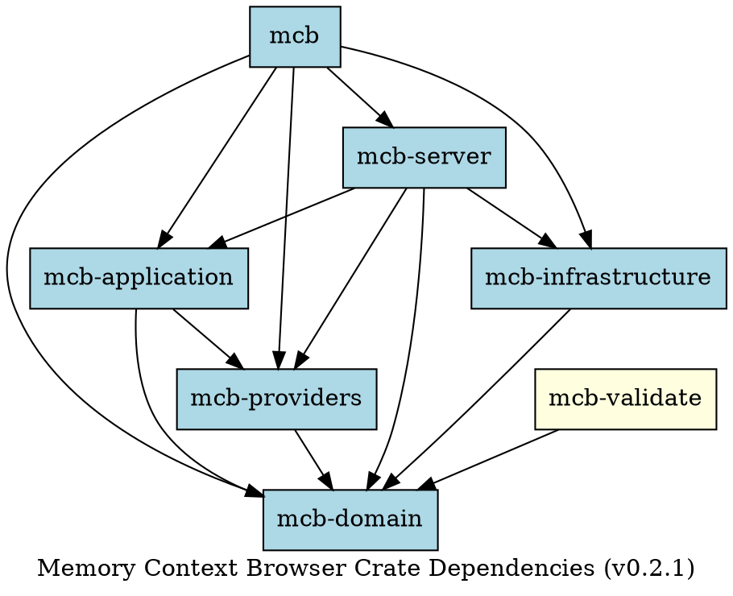

<!-- markdownlint-disable MD013 MD024 MD025 MD003 MD022 MD031 MD032 MD036 MD041 MD060 -->
# Module Dependencies

This document shows the crate dependencies of the Memory Context Browser.

## Crate Dependency Graph



## Dependency Layers

```text
                    ┌─────────┐
                    │   mcb   │  (Facade)
                    └────┬────┘
                         │
         ┌───────────────┼───────────────┐
         │               │               │
         ▼               ▼               ▼
    ┌─────────┐    ┌─────────┐    ┌─────────┐
    │ server  │    │  app    │    │validate │
    └────┬────┘    └────┬────┘    └────┬────┘
         │               │               │
         └───────┬───────┘               │
                 │                       │
         ┌───────┴───────┐               │
         │               │               │
         ▼               ▼               │
    ┌─────────┐    ┌─────────┐          │
    │providers│    │  infra  │          │
    └────┬────┘    └────┬────┘          │
         │               │               │
         └───────┬───────┴───────────────┘
                 │
                 ▼
            ┌─────────┐
            │ domain  │  (Innermost)
            └─────────┘
```

## Crate Descriptions

| Crate | Purpose | Dependencies |
| ------- | --------- | -------------- |
| `mcb` | Unified facade, public API | All crates |
| `mcb-domain` | Core types, ports, entities | None (innermost) |
| `mcb-application` | Business logic, use cases | domain, providers |
| `mcb-infrastructure` | DI, config, cross-cutting services | domain, application, providers |
| `mcb-providers` | External integrations | domain |
| `mcb-server` | MCP protocol, HTTP transport | All except validate |
| `mcb-validate` | Architecture validation | domain |

## Key Dependency Patterns

1. **Domain is dependency-free**: `mcb-domain` has no internal crate dependencies
2. **Clean Architecture layers**: Dependencies flow inward toward domain
3. **Facade aggregates**: `mcb` crate re-exports from all other crates
4. **Validation is isolated**: `mcb-validate` only depends on domain

## External Dependencies

Major external crates:

| Category | Crate | Purpose |
| ---------- | ------- | --------- |
| Async | `tokio` | Async runtime |
| HTTP | `poem` | HTTP server (ADR-026) |
| DI | `linkme` | Compile-time provider discovery + manual composition root with handles (ADR-050) |
| Serialization | `serde` | JSON/TOML serialization |
| Error handling | `thiserror`, `anyhow` | Error types |
| Parsing | `tree-sitter-*` | AST parsing |
| AI | `reqwest` | HTTP client for AI APIs |

---

### Updated 2026-02-22 - linkme + AppContext manual composition root, v0.2.1
